# Lab8Web
## PHP dan Database MySQl

<hr>
Nama : Faza Ardan Kusuma<br>
NIM : 312010001<br>
Kelas : TI 20 B1<br>
<hr>

Disini saya mendapatkan tugas untuk memahami dan membuat program CRUD menggunakan PHP. Saya akan mengerjakan semua latihan lalu akan saya jelaskan pada setiap langkahnya.<br>
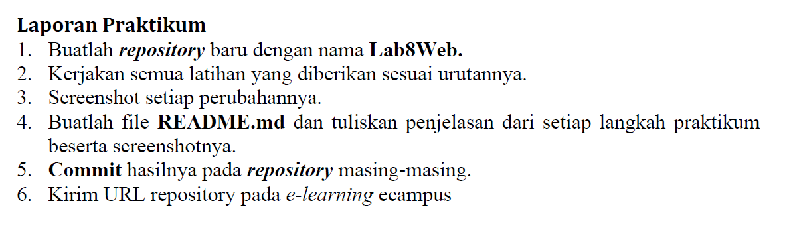<br>

## Menjalankan Server
Untuk menjalankan server MySQL server, buka aplikasi XAMPP lalu start Apache dan MySQL. <br>
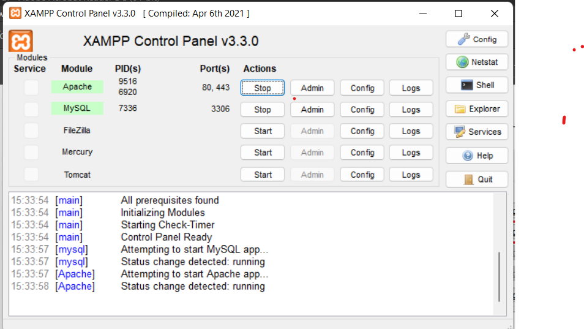.<br>
Kemudian buka melalui browser dengan link berikut http://localhost/phpmyadmin/.<br>

## Membuat Database
Disini saya akan membuat database dengan nama latihan1.<br>
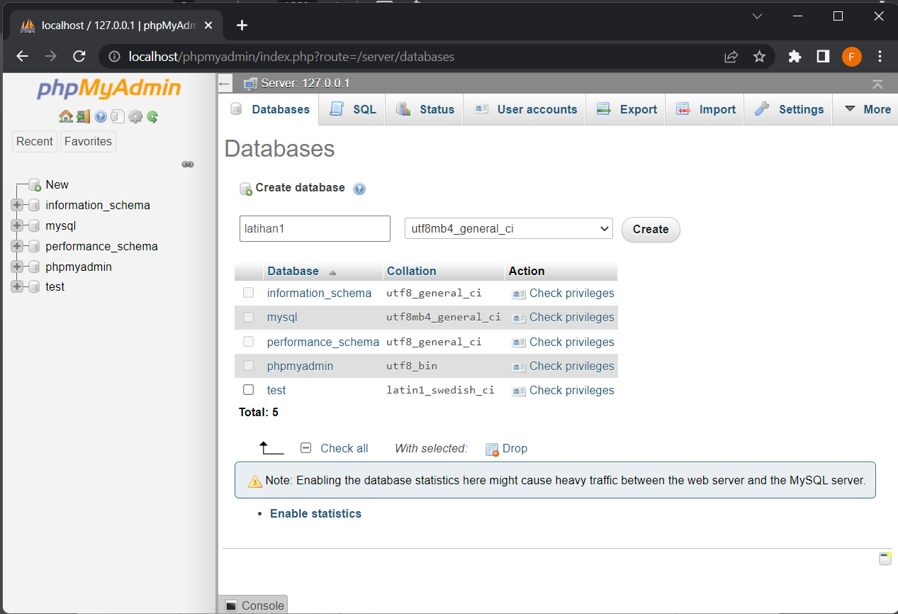<br>

Kemudian saya membuat tabel dengan cara masuk ke database latihan1 dan ke sub menu SQL.<br>
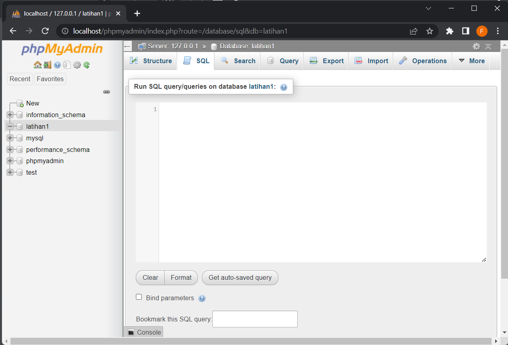<br>
Lalu masukan syntax berikut :
```
CREATE TABLE data_barang ( 
    id_barang int(10) auto_increment Primary Key, 
    kategori varchar(30), 
    nama varchar(30), 
    gambar varchar(100), 
    harga_beli decimal(10,0), 
    harga_jual decimal(10,0), 
    stok int(4) 
);    
```
Bila berhasil akan seperti ini tampilannya :<br>
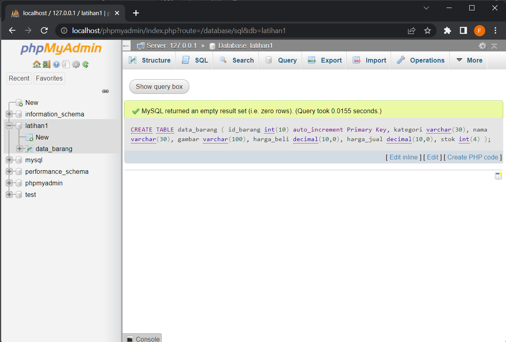<br>

## Menambahkan Data
Setelah selesai membuat tabel, saya akan menambahkan data. Masih dengan cara yang tadi ke Sub Menu SQL, lalu masukan syntax berikut :<br>
```
INSERT INTO data_barang (kategori, nama, gambar, harga_beli, harga_jual, stok) 
VALUES ('Elektronik', 'HP Samsung Android', 'hp_samsung.jpg', 2000000, 2400000, 5), 
('Elektronik', 'HP Xiaomi Android', 'hp_xiaomi.jpg', 1000000, 1400000, 5), 
('Elektronik', 'HP OPPO Android', 'hp_oppo.jpg', 1800000, 2300000, 5);
```
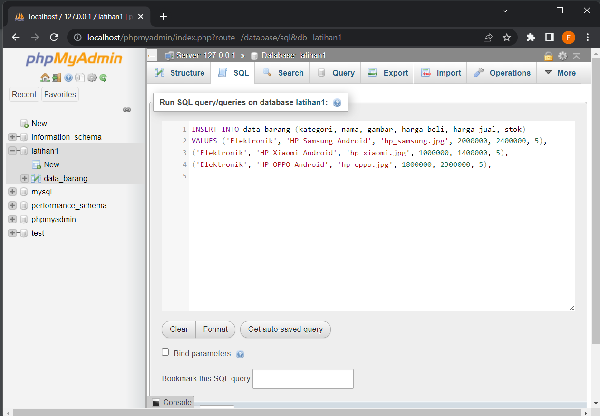<br>
Bila Sukses maka seperti berikut :<br>
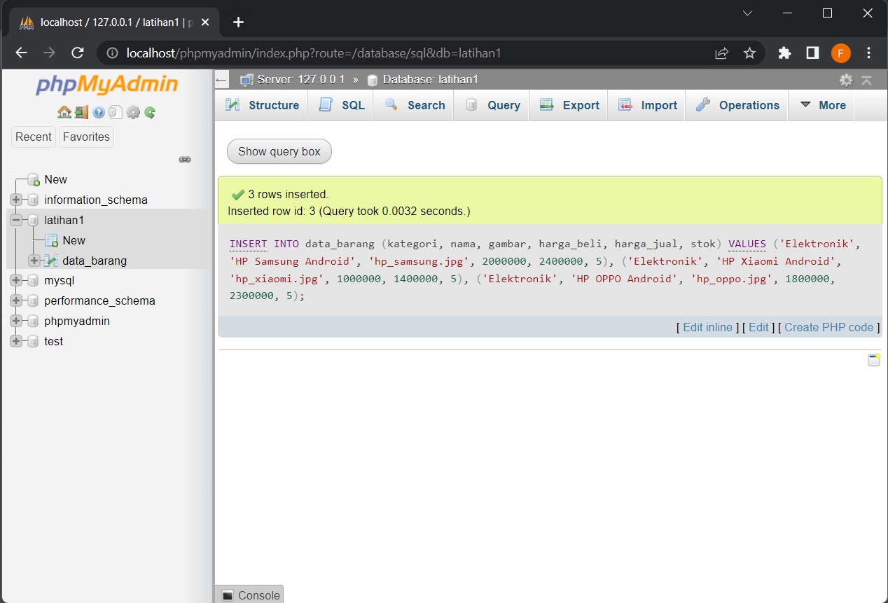<br>

## Membuat Program CRUD
Pertama saya buat folder <b>lab8_web_php</b> pada root directory.<br>
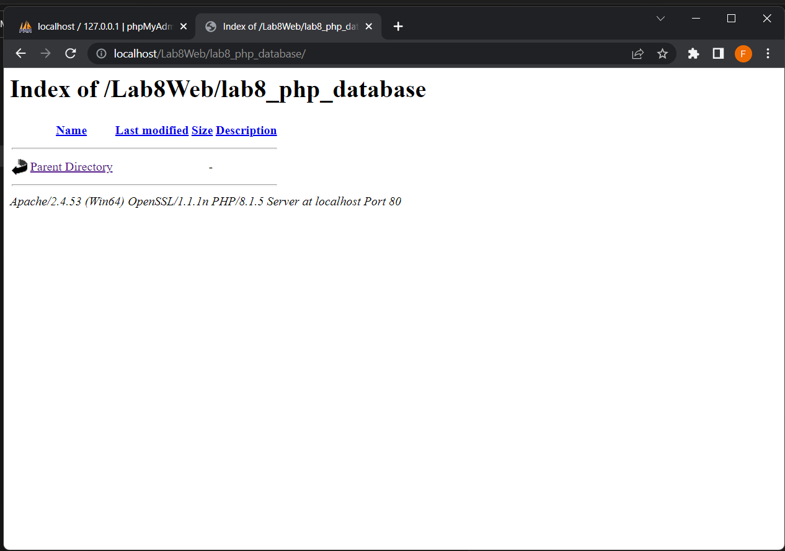<br>

### Membuat Koneksi Database
Kemudian masuk ke dalam folder tadi dan buat file baru dengan nama koneksi.php dan masukkan syntax berikut :<br>
```
<!DOCTYPE html>
<html lang="en">
<head>
    <meta charset="UTF-8">
    <meta http-equiv="X-UA-Compatible" content="IE=edge">
    <meta name="viewport" content="width=device-width, initial-scale=1.0">
    <title>Koneksi</title>
</head>
<body>
<?php 
$host = "localhost"; 
$user = "root"; 
$pass = ""; 
$db = "latihan1"; 

$conn = mysqli_connect($host, $user, $pass, $db); 
if ($conn == false) 
{ 
    echo "Koneksi ke server gagal."; 
    die(); 
} 
else 
{ 
    echo "Koneksi berhasil"; 
}
?>
</body>
</html>
```
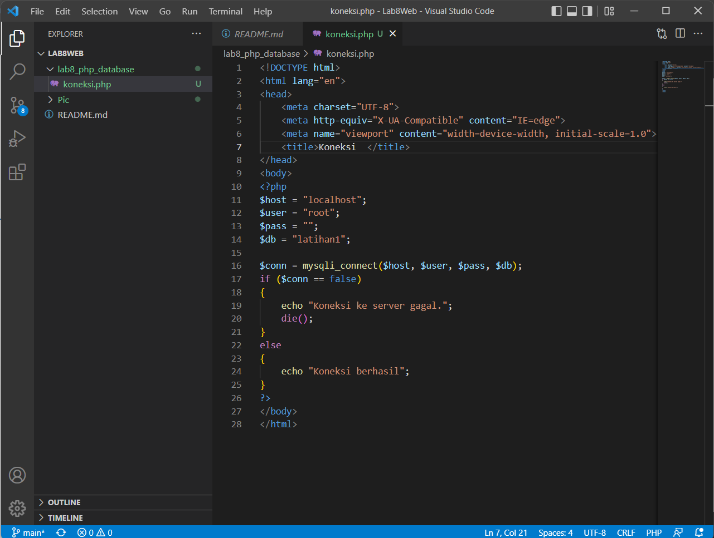<br>
Hasilnya seperti berikut :<br>
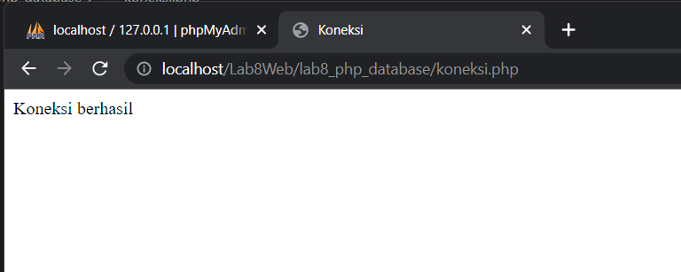<br>

### Membuat file index untuk menampilkan data
Buat file baru dengan nama index.php dengan syntax berikut :<br>
```
<?php 
include("koneksi.php"); 

// query untuk menampilkan data 
$sql = 'SELECT * FROM data_barang'; 
$result = mysqli_query($conn, $sql); 
?>

<!DOCTYPE html>
<html lang="en">
<head>
    <meta charset="UTF-8">
    <meta http-equiv="X-UA-Compatible" content="IE=edge">
    <meta name="viewport" content="width=device-width, initial-scale=1.0">
    <link href="https://cdn.jsdelivr.net/npm/bootstrap@5.2.0-beta1/dist/css/bootstrap.min.css" rel="stylesheet" integrity="sha384-0evHe/X+R7YkIZDRvuzKMRqM+OrBnVFBL6DOitfPri4tjfHxaWutUpFmBp4vmVor" crossorigin="anonymous">
    <script src="https://cdn.jsdelivr.net/npm/bootstrap@5.2.0-beta1/dist/js/bootstrap.bundle.min.js" integrity="sha384-pprn3073KE6tl6bjs2QrFaJGz5/SUsLqktiwsUTF55Jfv3qYSDhgCecCxMW52nD2" crossorigin="anonymous"></script>
    <title>Index</title>
</head>
<body>
    <div class="container"> 
        <div class="row">
            <div class="col-sm12">
                <div class="text-center">
                    <h1>Data Barang</h1>
                    <hr>
                </div>
            </div>
        </div>
        <div class="row">
            <div class="col-sm-12">            
                <a href="tambah.php" style="text-decoration: none;"><button class="btn btn-primary"><i class="fa fa-plus"></i> Tambah</button></a> <br><br>
                    <table class="table table-striped table-bordered">
                        <thead class="text-center">
                            <th>Gambar</th> 
                            <th>Nama Barang</th> 
                            <th>Katagori</th> 
                            <th>Harga Jual</th> 
                            <th>Harga Beli</th> 
                            <th>Stok</th> 
                            <th>Aksi</th> 
                        </thread>
                        <tbody> 
                        <?php
                            if($result):
                                while($row = mysqli_fetch_array($result)):
                        ?>
                        <tr>
                            <td>" class="rounded mx-auto d-block"></td>
                            <td><?= $row['nama']; ?></td>
                            <td><?= $row['kategori']; ?></td>
                            <td class="text-center"><?= $row['harga_beli']; ?></td>
                            <td class="text-center"><?= $row['harga_jual']; ?></td>
                            <td class="text-center"><?= $row['stok']; ?></td>
                            <td>
                                <a href="ubah.php?id=<?= $row['id_barang'];?>">Ubah</a>
                                <a href="hapus.php?id=<?= $row['id_barang'];?>">Hapus</a>
                            </td>
                        </tr>
                            <?php endwhile; else: ?>
                            <tr>
                                <td colspan="7">Tidak ada data</td>
                            </tr>
                            <?php endif; ?>
                        </tbody>
                    </table>
            </div>
        </div>
    </div>
</body>
</html>
```
Disini saya menggunakan bootstrap, dan berikut hasilnya :<br>
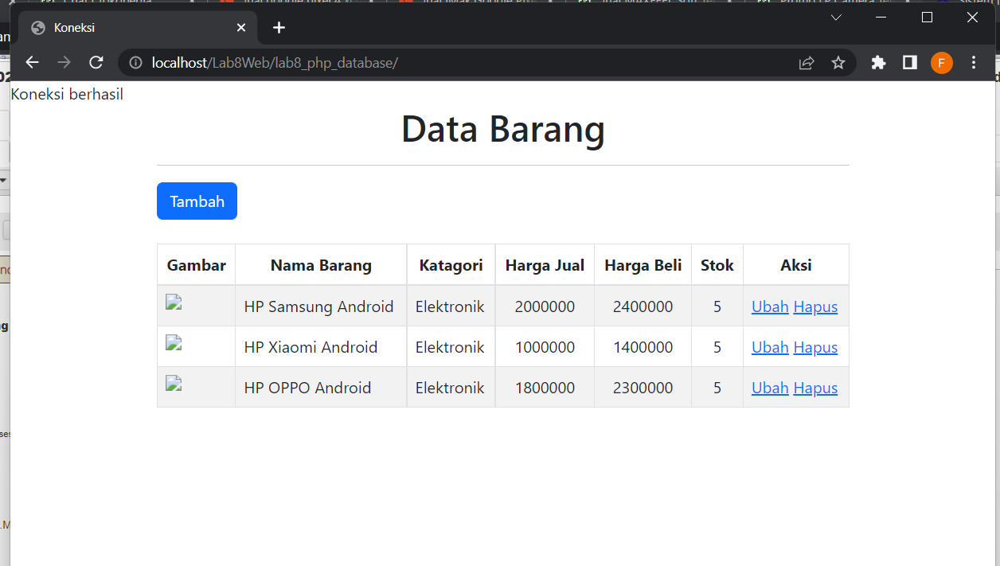<br>

